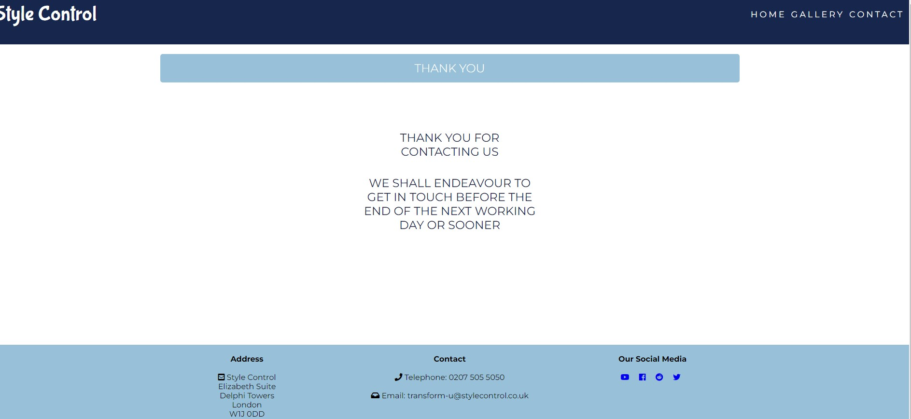
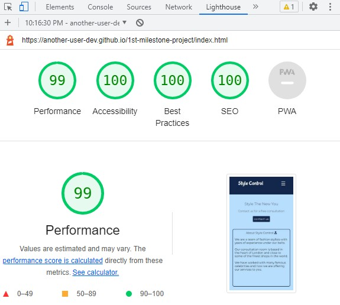

# PROJECT MILESTONE ONE - STYLE CONTROL WEBSITE

 

## Website:
 

Live deployed [link](https://another-user-dev.github.io/1st-milestone-project/)

https://another-user-dev.github.io/1st-milestone-project/

This is my first website for the milestone one project. A requirement by Code Institute as part of their learning module and count towards a Level 5 Qualification.

### User Perspective
 

* To intuitively navigate a website using a navigation bar 
* To view a well designed structured website with the ease of accessing required information, consistent styling of links and buttons to aid navigation
* Not be distracted by poor user interface experience such as: dead links, external links not opening in a separate page' information is not distracted with background
* Able to find information according to expectations
* View services in a defined structure and visually pleasing web pages
* Ease of contacting the business through use of call to action buttons and navigation links
* Able to use various technology devices (laptops, tablets, mobile phones) to surf the website
 

### Business Perspective
 

* To provide an intuitive navigable website with a clear structured layout
* To provide a website meeting the needs of accessible guidelines such as gallery pictures annotated with alternative text for screen readers
* To provide a website with a clean design that promotes the business in a professional tone
* Use of website as a starting point for obtaining customers
* Promoting social media websites 
* Provide a scalable platform where more services can be offered as the business develops - for example adding events management service to the home page
* Enable customers to surf the website using a variety of devices such desktops, laptops, tablets and mobile phones
 

## The features of the website: 
 

### Structure of the website

The website consists of a home page, gallery page and a contact us page. Each page has a navigation bar in the header, a content section covering the mid part of the page and footer section containing useful information and social media links.

### The navigation header
 
 

 
 
The navigation header, as seen as above, appears consistently on the top of the three main content pages. The company's logo is featured on the left hand side of the navigation bar while there are navigation links for other pages on the right hand side. 
 
 
This familiar menu bar adds consistency to the design language and helps the user to navigate across the three pages without confusion.
 
 

 
 

Similarly, the mobile header bar offers the same functionality and purpose as its desktop brethren but in a smaller form factor. The hamburger icon neatly displays and retracts the navigation links. Increasing the screen width also closes the navigation links without having to select the Hamburger icon.
 
 

### Content section
 
 

 
 
Here we see the content page featuring a hero image  with a carrot on a stick special offer and a call for action button to book a free consultation. 
 
 

 
 
The mobile content does not feature the hero image but still displays the same carrot on a stick offer with a call for action button to book a free consulation button. 
 
 
This allows a mobile device to have a clutter free visual appearance.
 
 

###  Footer section
 

 
 

 
 
The above two images show the footer for the larger screen and mobile phone screen. There is no loss in functionality or feature between the two types of footer. 

 

### Services

 

 

 

Again, both images display services content in various combinations to take full advantage of screen width at its disposal.

 

### Gallery Page
 

 

The gallery page gives an eye pleasing visual images. The photos were sourced from Unsplash.com and were chosen for their timeless style and perfect fit of clothes. This ties in with the role of the stylist. Whose main aim is to advise on well fitting clothes and timeless styling advise.
 

The mobile phone gallery is displayed in a vertical order.

 

### Contact Us Page

 

 

This simple contact us page provides the customer a facility to contact the stylists. The call for action buttons also links to this page from the hero image text. Thereby the contact us page is a very important structure of the website that starts the journey for customers toward services.
 

### Structure of the website
 
The website consists of a home page, gallery page and a contact us page. Each page has a navigation bar in the header, a content section covering the mid part of the page and footer section containing useful information and social media links.
 

#### Thank you page
 

 

User feedback suggested the use of a thank you page which thanks the user for completing the contact form. This adds a nice personal touch and professionalism.
 

### Wireframes of website
 
My main aim was to produce an effective layout for all device types.
 
Here are my sketches for the website pages including desktop and mobile devices.
 
[Wireframe page 1](assets/r-images/readmesketch1.jpg)
 
[Wireframe page 2](assets/r-images/readmesketch2.jpg)
 
[Wireframe page 3](assets/r-images/readmesketch3.jpg)
 
I feel I have mostly achieved in a building a website according to those website. The only slight change was the gallery page for the larger screen. A different layout broke up the the monotony of uniformed square boxes.

 

### Design considerations

 

Blue is the dominate colour on the website. It was chosen as blue is known to instill trust and trust is very important concept in business.
 

Colours were sourced from Coolers.co and I used Google to find the hex code for blue ink, colour cornflower blue. Usage of colours was sparse and consistent in order to produce an understated corporate style website. Hover pseudo classes were used in conjunction with colour effects on links and buttons. 
 

Fonts were sourced from Google fonts. Bubble gum Sans provided a nice text for company logo. While Montserrat is a popular font for websites.
 

Font Awesome provided style fonts such as social media logos as well as visual clues for services within the home content page.
 
Internal navigation links, buttons and Hamburger bar all feature consistent styling. Ink blue background with

### Technologies utilised

 

HTML5 for markup  
CSS3 for style  
Google Fonts for fonts  
Github to keep the file  
Gitpod for version control  
[AmIresponsive](https://ui.dev/amiresponsive) 
Coolers.co to build a colour palette for the site  
Font Awesome for icons  
Chrome tools 
Unsplash for all the images on the site  
[iloveimg.com](https://www.iloveimg.com/) to compress file size for images  

## Debugging the code for the website

There were a number of issues which slowed the development of the website.

1. Div and section heights had caused formatting issues such as content flowing from one section to another unexpectedly. My mentor had advised on a fix which solved the issue by removing the set height to auto in each section.
 

2. This Bootstrap code <link rel="stylesheet" href="https://maxcdn.bootstrapcdn.com/bootstrap/4.1.3/css/bootstrap.min.css"> caused the content on the home page to spill out of the content container. Removing this link resulted in the content reverting to its original state.
 

3. I originally planned to use Bootstrap for the main navigation and burger menu. I realised Bootstrap was unviable due to the issues as described above. Flexbox provided the perfect opportunity to replace the Bootstrap requirement.
 

4. A mismatch of section widths caused the content to flow horizontally. This was resolved by ensuring the content widths were harmonised by using a centred max-width page with width at 100%.
 

5. Implementing the burger menu turned out to be very difficult. This was because the toggle code in the media query required to share the same parent tag in HTML and CSS as other associated code. This was tested commenting out the code in one section and applying the same code in another. Ultimately, this led to having a more appreciation of HTML/CSS code.
 

6. The adblocker in my browser caused the setting up of an image folder to inline in Gitpod. This resulted the folder to have an unexpected file path. The solution was to delete the folder and deactivate the adblocker before setting up a new folder.
 

7. Github refused to give an active URL for my website after deployment. The issue was resolved after contacting tutor support. The issue resolved itself as soon as I enetered a git push command in Gitpod.
 

8. The screen reader refused to read out the alt text for the photos in the gallery section while using the Chrome browser. The issue is unresolved but student support indicated that there isn't a penalty for the project as long as the photos have alt text added. The issue did not appear during testing with Firefox browser. It seems likely there is a bug in Chrome.
 

9. An issue appeared where the footer CSS was corrupted with a cross typo error from git. This caused formatting issues in the footer. Fortunately the problem was identified and corrected.
 

10. Hamburger icon had an extended background which almost reached the top of the header. Chrome tools was used to investigate the anomaly. Each part of the code in the header was inspected and the styling CSS was displayed under styles. The issue was resolved after deleting the line height and adjusting the margin-top to the CSS code for desktop and mobile. The newly styled Hamburger menu was saved under the commit message "Add styling to Hamburger menu". 
 

11. Low contrast ratio for white text and cornflower blue background resulted in lowering the Lighthouse accessibility score by 5 to 6% on Lighthouse the gallery and contact page. There was a conflict between design and accessibility. I liked the white text against the blue background which was more consistent with the design of the website. I also wanted the website to have a 100 per cent compliance with accessibility.
 
Further research on accessibility colours led me to this website [UXmovement.com](https://uxmovement.com/buttons/the-myths-of-color-contrast-accessibility/). After reading this article, changing the colours to become more accessibility compliant meant there was no guarantee it would improve accessibility for users. In some cases it may worsen for some. 
 
Upon reflection, I've decided to keep the colours as they are now given the high accessibility Lighthouse scores and the title header not having a significant impact on understanding the content. It is visually obvious the difference between a contact and a gallery page. 
 

### Manual testing

1. The website was tested on Chrome, Firefox and Brave browsers. No adverse affects were found. I was unable to use Safari as its developer has not provided a Windows version for years.
 
2. The website is easy to navigate and the hamburger menu worked effectively.
 
3. Responsiveness were tested using all devices and screen widths. No adverse effects were seen for screen widths down to Galaxy Fold. 
 

### Home page links
 

<table class="tg">
<thead>
  <tr>
    <th class="tg-0lax">Feature</th>
    <th class="tg-0lax">Expect</th>
    <th class="tg-0lax">Action</th>
    <th class="tg-0lax">Result</th>
  </tr>
</thead>
<tbody>
  <tr>
    <td class="tg-0lax">Logo</td>
    <td class="tg-0lax">To visit Home page on click</td>
    <td class="tg-0lax">Click logo on the top left hand side</td>
    <td class="tg-0lax">Home page opened after click</td>
  </tr>
  <tr>
    <td class="tg-0lax">Home</td>
    <td class="tg-0lax">To visit Home page on click</td>
    <td class="tg-0lax">Click Home link on nav bar</td>
    <td class="tg-0lax">Home page opened after click</td>
  </tr>
  <tr>
    <td class="tg-0lax">Gallery</td>
    <td class="tg-0lax">To visit Gallery page on click</td>
    <td class="tg-0lax">Click Gallery on nav bar</td>
    <td class="tg-0lax">Gallery page opened after click</td>
  </tr>
  <tr>
    <td class="tg-0lax">Contact</td>
    <td class="tg-0lax">To visit Contact page on click</td>
    <td class="tg-0lax">Click Contact on nav bar</td>
    <td class="tg-0lax">Contact page opened after click</td>
  </tr>
  <tr>
    <td class="tg-0lax">CTA button</td>
    <td class="tg-0lax">To visit Contact page on click</td>
    <td class="tg-0lax">Click CTA button</td>
    <td class="tg-0lax">Contact page opened after click</td>
  </tr>
  <tr>
    <td class="tg-0lax">YouTube</td>
    <td class="tg-0lax">To visit YouTube page in new tab</td>
    <td class="tg-0lax">Click YouTube icon on footer</td>
    <td class="tg-0lax">YouTube page opened in new tab after click</td>
  </tr>
  <tr>
    <td class="tg-0lax">Facebook</td>
    <td class="tg-0lax">To visit Facebook page in new tab</td>
    <td class="tg-0lax">Click Facebook icon on footer</td>
    <td class="tg-0lax">Facebook opened in new tab after click</td>
  </tr>
  <tr>
    <td class="tg-0lax">Reddit</td>
    <td class="tg-0lax">To visit Reddit page in new tab</td>
    <td class="tg-0lax">Click Reddit icon on footer</td>
    <td class="tg-0lax">Reddit opened in new tab after click</td>
  </tr>
  <tr>
    <td class="tg-0lax">Twitter</td>
    <td class="tg-0lax">To visit Twitter page in new tab</td>
    <td class="tg-0lax">Click Twitter icon on footer</td>
    <td class="tg-0lax">Twitter opened in new tab after click</td>
  </tr>
</tbody>
</table>

  

### Gallery page links

 

<table class="tg">
<thead>
  <tr>
    <th class="tg-0lax">Feature</th>
    <th class="tg-0lax">Expect</th>
    <th class="tg-0lax">Action</th>
    <th class="tg-0lax">Result</th>
  </tr>
</thead>
<tbody>
  <tr>
    <td class="tg-0lax">Logo</td>
    <td class="tg-0lax">To visit Home page on click</td>
    <td class="tg-0lax">Click logo on the top left hand side</td>
    <td class="tg-0lax">Home page opened after click</td>
  </tr>
  <tr>
    <td class="tg-0lax">Home</td>
    <td class="tg-0lax">To visit Home page on click</td>
    <td class="tg-0lax">Click Home link on nav bar</td>
    <td class="tg-0lax">Home page opened after click</td>
  </tr>
  <tr>
    <td class="tg-0lax">Gallery</td>
    <td class="tg-0lax">To visit Gallery page on click</td>
    <td class="tg-0lax">Click Gallery on nav bar</td>
    <td class="tg-0lax">Gallery page opened after click</td>
  </tr>
  <tr>
    <td class="tg-0lax">Contact</td>
    <td class="tg-0lax">To visit Contact page on click</td>
    <td class="tg-0lax">Click Contact on nav bar</td>
    <td class="tg-0lax">Contact page opened after click</td>
  </tr>
  <tr>
    <td class="tg-0lax">YouTube</td>
    <td class="tg-0lax">To visit YouTube page in new tab</td>
    <td class="tg-0lax">Click YouTube icon on footer</td>
    <td class="tg-0lax">YouTube page opened in new tab after click</td>
  </tr>
  <tr>
    <td class="tg-0lax">Facebook</td>
    <td class="tg-0lax">To visit Facebook page in new tab</td>
    <td class="tg-0lax">Click Facebook icon on footer</td>
    <td class="tg-0lax">Facebook opened in new tab after click</td>
  </tr>
  <tr>
    <td class="tg-0lax">Reddit</td>
    <td class="tg-0lax">To visit Reddit page in new tab</td>
    <td class="tg-0lax">Click Reddit icon on footer</td>
    <td class="tg-0lax">Reddit opened in new tab after click</td>
  </tr>
  <tr>
    <td class="tg-0lax">Twitter</td>
    <td class="tg-0lax">To visit Twitter page in new tab</td>
    <td class="tg-0lax">Click Twitter icon on footer</td>
    <td class="tg-0lax">Twitter opened in new tab after click</td>
  </tr>
</tbody>
</table>

### Contact page links

 

<table class="tg">
<thead>
  <tr>
    <th class="tg-0lax">Feature</th>
    <th class="tg-0lax">Expect</th>
    <th class="tg-0lax">Action</th>
    <th class="tg-0lax">Result</th>
  </tr>
</thead>
<tbody>
  <tr>
    <td class="tg-0lax">Logo</td>
    <td class="tg-0lax">To visit Home page on click</td>
    <td class="tg-0lax">Click logo on the top left hand side</td>
    <td class="tg-0lax">Home page opened after click</td>
  </tr>
  <tr>
    <td class="tg-0lax">Home</td>
    <td class="tg-0lax">To visit Home page on click</td>
    <td class="tg-0lax">Click Home link on nav bar</td>
    <td class="tg-0lax">Home page opened after click</td>
  </tr>
  <tr>
    <td class="tg-0lax">Gallery</td>
    <td class="tg-0lax">To visit Gallery page on click</td>
    <td class="tg-0lax">Click Gallery on nav bar</td>
    <td class="tg-0lax">Gallery page opened after click</td>
  </tr>
  <tr>
    <td class="tg-0lax">Contact</td>
    <td class="tg-0lax">To visit Contact page on click</td>
    <td class="tg-0lax">Click Contact on nav bar</td>
    <td class="tg-0lax">Contact page opened after click</td>
  </tr>
  <tr>
    <td class="tg-0lax">YouTube</td>
    <td class="tg-0lax">To visit YouTube page in new tab</td>
    <td class="tg-0lax">Click YouTube icon on footer</td>
    <td class="tg-0lax">YouTube page opened in new tab after click</td>
  </tr>
  <tr>
    <td class="tg-0lax">Facebook</td>
    <td class="tg-0lax">To visit Facebook page in new tab</td>
    <td class="tg-0lax">Click Facebook icon on footer</td>
    <td class="tg-0lax">Facebook opened in new tab after click</td>
  </tr>
  <tr>
    <td class="tg-0lax">Reddit</td>
    <td class="tg-0lax">To visit Reddit page in new tab</td>
    <td class="tg-0lax">Click Reddit icon on footer</td>
    <td class="tg-0lax">Reddit opened in new tab after click</td>
  </tr>
  <tr>
    <td class="tg-0lax">Twitter</td>
    <td class="tg-0lax">To visit Twitter page in new tab</td>
    <td class="tg-0lax">Click Twitter icon on footer</td>
    <td class="tg-0lax">Twitter opened in new tab after click</td>
  </tr>
</tbody>
</table>
 

### The thank you page 
 

 

<table class="tg">
<thead>
  <tr>
    <th class="tg-0lax">Feature</th>
    <th class="tg-0lax">Expect</th>
    <th class="tg-0lax">Action</th>
    <th class="tg-0lax">Result</th>
  </tr>
</thead>
<tbody>
  <tr>
    <td class="tg-0lax">Logo</td>
    <td class="tg-0lax">To visit Home page on click</td>
    <td class="tg-0lax">Click logo on the top left hand side</td>
    <td class="tg-0lax">Home page opened after click</td>
  </tr>
  <tr>
    <td class="tg-0lax">Home</td>
    <td class="tg-0lax">To visit Home page on click</td>
    <td class="tg-0lax">Click Home link on nav bar</td>
    <td class="tg-0lax">Home page opened after click</td>
  </tr>
  <tr>
    <td class="tg-0lax">Gallery</td>
    <td class="tg-0lax">To visit Gallery page on click</td>
    <td class="tg-0lax">Click Gallery on nav bar</td>
    <td class="tg-0lax">Gallery page opened after click</td>
  </tr>
  <tr>
    <td class="tg-0lax">Contact</td>
    <td class="tg-0lax">To visit Contact page on click</td>
    <td class="tg-0lax">Click Contact on nav bar</td>
    <td class="tg-0lax">Contact page opened after click</td>
  </tr>
  <tr>
    <td class="tg-0lax">YouTube</td>
    <td class="tg-0lax">To visit YouTube page in new tab</td>
    <td class="tg-0lax">Click YouTube icon on footer</td>
    <td class="tg-0lax">YouTube page opened in new tab after click</td>
  </tr>
  <tr>
    <td class="tg-0lax">Facebook</td>
    <td class="tg-0lax">To visit Facebook page in new tab</td>
    <td class="tg-0lax">Click Facebook icon on footer</td>
    <td class="tg-0lax">Facebook opened in new tab after click</td>
  </tr>
  <tr>
    <td class="tg-0lax">Reddit</td>
    <td class="tg-0lax">To visit Reddit page in new tab</td>
    <td class="tg-0lax">Click Reddit icon on footer</td>
    <td class="tg-0lax">Reddit opened in new tab after click</td>
  </tr>
  <tr>
    <td class="tg-0lax">Twitter</td>
    <td class="tg-0lax">To visit Twitter page in new tab</td>
    <td class="tg-0lax">Click Twitter icon on footer</td>
    <td class="tg-0lax">Twitter opened in new tab after click</td>
  </tr>
</tbody>
</table>

 

### Mobile Home page links
 

<table class="tg">
<thead>
  <tr>
    <th class="tg-0lax">Feature</th>
    <th class="tg-0lax">Expect</th>
    <th class="tg-0lax">Action</th>
    <th class="tg-0lax">Result</th>
  </tr>
</thead>
<tbody>
  <tr>
    <td class="tg-0lax">Logo</td>
    <td class="tg-0lax">To visit Home page on click</td>
    <td class="tg-0lax">Click logo on the top left hand side</td>
    <td class="tg-0lax">Home page opened after click</td>
  </tr>
  <tr>
    <td class="tg-0lax">Home</td>
    <td class="tg-0lax">To visit Home page on click</td>
    <td class="tg-0lax">Click Home link on nav bar</td>
    <td class="tg-0lax">Home page opened after click</td>
  </tr>
  <tr>
    <td class="tg-0lax">Gallery</td>
    <td class="tg-0lax">To visit Gallery page on click</td>
    <td class="tg-0lax">Click Gallery on nav bar</td>
    <td class="tg-0lax">Gallery page opened after click</td>
  </tr>
  <tr>
    <td class="tg-0lax">Contact</td>
    <td class="tg-0lax">To visit Contact page on click</td>
    <td class="tg-0lax">Click Contact on nav bar</td>
    <td class="tg-0lax">Contact page opened after click</td>
  </tr>
  <tr>
    <td class="tg-0lax">CTA button</td>
    <td class="tg-0lax">To visit Contact page on click</td>
    <td class="tg-0lax">Click CTA button</td>
    <td class="tg-0lax">Contact page opened after click</td>
  </tr>
  <tr>
    <td class="tg-0lax">YouTube</td>
    <td class="tg-0lax">To visit YouTube page in new tab</td>
    <td class="tg-0lax">Click YouTube icon on footer</td>
    <td class="tg-0lax">YouTube page opened in new tab after click</td>
  </tr>
  <tr>
    <td class="tg-0lax">Facebook</td>
    <td class="tg-0lax">To visit Facebook page in new tab</td>
    <td class="tg-0lax">Click Facebook icon on footer</td>
    <td class="tg-0lax">Facebook opened in new tab after click</td>
  </tr>
  <tr>
    <td class="tg-0lax">Reddit</td>
    <td class="tg-0lax">To visit Reddit page in new tab</td>
    <td class="tg-0lax">Click Reddit icon on footer</td>
    <td class="tg-0lax">Reddit opened in new tab after click</td>
  </tr>
  <tr>
    <td class="tg-0lax">Twitter</td>
    <td class="tg-0lax">To visit Twitter page in new tab</td>
    <td class="tg-0lax">Click Twitter icon on footer</td>
    <td class="tg-0lax">Twitter opened in new tab after click</td>
  </tr>
</tbody>
</table>

 

### Mobile Gallery page links

 

<table class="tg">
<thead>
  <tr>
    <th class="tg-0lax">Feature</th>
    <th class="tg-0lax">Expect</th>
    <th class="tg-0lax">Action</th>
    <th class="tg-0lax">Result</th>
  </tr>
</thead>
<tbody>
  <tr>
    <td class="tg-0lax">Logo</td>
    <td class="tg-0lax">To visit Home page on click</td>
    <td class="tg-0lax">Click logo on the top left hand side</td>
    <td class="tg-0lax">Home page opened after click</td>
  </tr>
  <tr>
    <td class="tg-0lax">Home</td>
    <td class="tg-0lax">To visit Home page on click</td>
    <td class="tg-0lax">Click Home link on nav bar</td>
    <td class="tg-0lax">Home page opened after click</td>
  </tr>
  <tr>
    <td class="tg-0lax">Gallery</td>
    <td class="tg-0lax">To visit Gallery page on click</td>
    <td class="tg-0lax">Click Gallery on nav bar</td>
    <td class="tg-0lax">Gallery page opened after click</td>
  </tr>
  <tr>
    <td class="tg-0lax">Contact</td>
    <td class="tg-0lax">To visit Contact page on click</td>
    <td class="tg-0lax">Click Contact on nav bar</td>
    <td class="tg-0lax">Contact page opened after click</td>
  </tr>
  <tr>
    <td class="tg-0lax">YouTube</td>
    <td class="tg-0lax">To visit YouTube page in new tab</td>
    <td class="tg-0lax">Click YouTube icon on footer</td>
    <td class="tg-0lax">YouTube page opened in new tab after click</td>
  </tr>
  <tr>
    <td class="tg-0lax">Facebook</td>
    <td class="tg-0lax">To visit Facebook page in new tab</td>
    <td class="tg-0lax">Click Facebook icon on footer</td>
    <td class="tg-0lax">Facebook opened in new tab after click</td>
  </tr>
  <tr>
    <td class="tg-0lax">Reddit</td>
    <td class="tg-0lax">To visit Reddit page in new tab</td>
    <td class="tg-0lax">Click Reddit icon on footer</td>
    <td class="tg-0lax">Reddit opened in new tab after click</td>
  </tr>
  <tr>
    <td class="tg-0lax">Twitter</td>
    <td class="tg-0lax">To visit Twitter page in new tab</td>
    <td class="tg-0lax">Click Twitter icon on footer</td>
    <td class="tg-0lax">Twitter opened in new tab after click</td>
  </tr>
</tbody>
</table>

### Mobile Contact page links

 

<table class="tg">
<thead>
  <tr>
    <th class="tg-0lax">Feature</th>
    <th class="tg-0lax">Expect</th>
    <th class="tg-0lax">Action</th>
    <th class="tg-0lax">Result</th>
  </tr>
</thead>
<tbody>
  <tr>
    <td class="tg-0lax">Logo</td>
    <td class="tg-0lax">To visit Home page on click</td>
    <td class="tg-0lax">Click logo on the top left hand side</td>
    <td class="tg-0lax">Home page opened after click</td>
  </tr>
  <tr>
    <td class="tg-0lax">Home</td>
    <td class="tg-0lax">To visit Home page on click</td>
    <td class="tg-0lax">Click Home link on nav bar</td>
    <td class="tg-0lax">Home page opened after click</td>
  </tr>
  <tr>
    <td class="tg-0lax">Gallery</td>
    <td class="tg-0lax">To visit Gallery page on click</td>
    <td class="tg-0lax">Click Gallery on nav bar</td>
    <td class="tg-0lax">Gallery page opened after click</td>
  </tr>
  <tr>
    <td class="tg-0lax">Contact</td>
    <td class="tg-0lax">To visit Contact page on click</td>
    <td class="tg-0lax">Click Contact on nav bar</td>
    <td class="tg-0lax">Contact page opened after click</td>
  </tr>
  <tr>
    <td class="tg-0lax">YouTube</td>
    <td class="tg-0lax">To visit YouTube page in new tab</td>
    <td class="tg-0lax">Click YouTube icon on footer</td>
    <td class="tg-0lax">YouTube page opened in new tab after click</td>
  </tr>
  <tr>
    <td class="tg-0lax">Facebook</td>
    <td class="tg-0lax">To visit Facebook page in new tab</td>
    <td class="tg-0lax">Click Facebook icon on footer</td>
    <td class="tg-0lax">Facebook opened in new tab after click</td>
  </tr>
  <tr>
    <td class="tg-0lax">Reddit</td>
    <td class="tg-0lax">To visit Reddit page in new tab</td>
    <td class="tg-0lax">Click Reddit icon on footer</td>
    <td class="tg-0lax">Reddit opened in new tab after click</td>
  </tr>
  <tr>
    <td class="tg-0lax">Twitter</td>
    <td class="tg-0lax">To visit Twitter page in new tab</td>
    <td class="tg-0lax">Click Twitter icon on footer</td>
    <td class="tg-0lax">Twitter opened in new tab after click</td>
  </tr>
</tbody>
</table>
 

### Mobile thank you page 
 

 

<table class="tg">
<thead>
  <tr>
    <th class="tg-0lax">Feature</th>
    <th class="tg-0lax">Expect</th>
    <th class="tg-0lax">Action</th>
    <th class="tg-0lax">Result</th>
  </tr>
</thead>
<tbody>
  <tr>
    <td class="tg-0lax">Logo</td>
    <td class="tg-0lax">To visit Home page on click</td>
    <td class="tg-0lax">Click logo on the top left hand side</td>
    <td class="tg-0lax">Home page opened after click</td>
  </tr>
  <tr>
    <td class="tg-0lax">Home</td>
    <td class="tg-0lax">To visit Home page on click</td>
    <td class="tg-0lax">Click Home link on nav bar</td>
    <td class="tg-0lax">Home page opened after click</td>
  </tr>
  <tr>
    <td class="tg-0lax">Gallery</td>
    <td class="tg-0lax">To visit Gallery page on click</td>
    <td class="tg-0lax">Click Gallery on nav bar</td>
    <td class="tg-0lax">Gallery page opened after click</td>
  </tr>
  <tr>
    <td class="tg-0lax">Contact</td>
    <td class="tg-0lax">To visit Contact page on click</td>
    <td class="tg-0lax">Click Contact on nav bar</td>
    <td class="tg-0lax">Contact page opened after click</td>
  </tr>
  <tr>
    <td class="tg-0lax">YouTube</td>
    <td class="tg-0lax">To visit YouTube page in new tab</td>
    <td class="tg-0lax">Click YouTube icon on footer</td>
    <td class="tg-0lax">YouTube page opened in new tab after click</td>
  </tr>
  <tr>
    <td class="tg-0lax">Facebook</td>
    <td class="tg-0lax">To visit Facebook page in new tab</td>
    <td class="tg-0lax">Click Facebook icon on footer</td>
    <td class="tg-0lax">Facebook opened in new tab after click</td>
  </tr>
  <tr>
    <td class="tg-0lax">Reddit</td>
    <td class="tg-0lax">To visit Reddit page in new tab</td>
    <td class="tg-0lax">Click Reddit icon on footer</td>
    <td class="tg-0lax">Reddit opened in new tab after click</td>
  </tr>
  <tr>
    <td class="tg-0lax">Twitter</td>
    <td class="tg-0lax">To visit Twitter page in new tab</td>
    <td class="tg-0lax">Click Twitter icon on footer</td>
    <td class="tg-0lax">Twitter opened in new tab after click</td>
  </tr>
</tbody>
</table>

The Hamburger bar worked as expected during the testing of the mobile version of the website. The links above are evidence of an Hamburger navigation working as intended. 

### Contact forms

Both large and small screen version of the contact form were tested for their data validation. Data were required for each field.

The submit button functioned as normal.

Limitations of testing: unable to check if data were received by the backend.

 

### Automated testing

 

## 1. Lighthouse - larger screens
 

## Index page performance
 

 

### Gallery page performance
 

### Contact page performance
 

 

 

### Thank you page performance 
 

 

 

# 2. Lighthouse - mobile screens
 

## Index page performance
 

 

## Gallery page performance
 

 

 

## Contact page performance

 

 

### Thank you page performance 
 

 

 

## 3. W3c Jigsaw Validator tool
 

### Index page
 

 

### Gallery page
 

 

### Contact page
 

 

### Thank you page
 

 

##  W3c Jigsaw Validator tool 

### Index page  

   

### Gallery page  

 

### Contact page  

 

### Contact page  

 

### Summary of automated testing 

The automated testing screenshots above shows a clean bill of health in all of their metrics. The Lighthouse's accessibility scores for the gallery and contact pages have score 94 per cent or more. The Home page has achieved 100 per cent for Lighthouse accessibility.
 

# End User Assessment
 
The website has achieved many of its initial aims:

* almost mimic its original wireframing design
* easy to navigate
* clean design

## Credits
 
Hannah Morgan: hero image link https://unsplash.com/photos/ycVFts5Ma4s
 
Olga Zabegina: image https://unsplash.com/photos/A3MleA0jtoE
 
Laura Chouette: image https://unsplash.com/photos/CjB-8NY5at8
 
Laura Chouette: image https://unsplash.com/photos/QzekrIW57-4
 
Jacob Blakenship: image https://unsplash.com/photos/lfJil4DrWRU
 
Gregory Hayes image: https://unsplash.com/photos/h5cd51KXmRQ
 
Bejamin Rascoe image: https://unsplash.com/photos/ItqFmSxKnIg
 
Rafaella Mendes Diniz: image https://unsplash.com/photos/4lFzZTnaIcQ
 
Ali Morshedlou image: https://unsplash.com/photos/WMD64tMfc4k
 
Madhi Bafande image: https://unsplash.com/photos/6f5KtX2GGv4
 
Hamburger toggle code from Caler Edwards [YouTube](https://www.youtube.com/watch?v=xMTs8tAapnQ)
 
Gallery styling and its html structure came from [YouTube](https://www.youtube.com/watch?v=RuJyYiRttpI)
 
Thanks to:
 
Spencer Barriball who suggested the use of height: auto to resolve spilling of content into other sections & slight amendments to the contact form.
 
Chris Quinn, who suggested making slight alterations to contact form, advice on how to resolve the 20 code violations identified from the W3C validation checker.
 
Oisin from Tutor Support, Code Institute, who helped resolved the live website deployment on Github.

