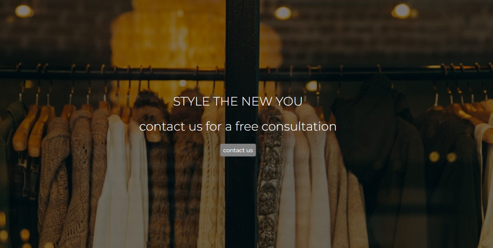
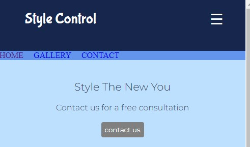
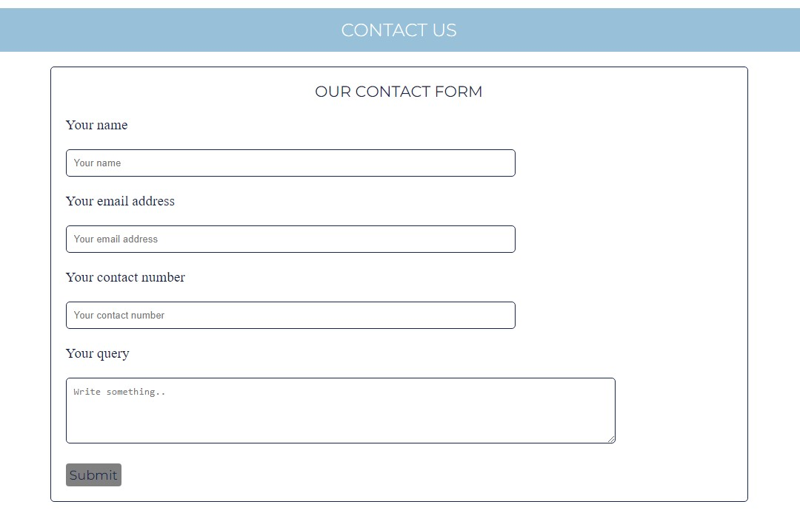

# PROJECT MILESTONE ONE - STYLE CONTROL WEBSITE

## Website:

Live deployed [link](https://another-user-dev.github.io/1st-milestone-project/)

https://another-user-dev.github.io/1st-milestone-project/

This is my first website for the milestone one project. A requirement by Code Institute as part of their learning module and count towards a Level 5 Qualification.

# The main aim of this website
* Provide an easy pathway for customers looking to up their game in the style stakes
* To allow customers to understand the services and benefits provided by a fictional group of elitist fashion stylists
* To give inspiration to customers who are looking to bring out the best version of theirselves

# UX - User Experience 

The project was planned in 5 stages. 

1st stage - Strategy Plane  
2nd stage - Scope Plane  
3rd stage - Structure Plane  
4th stage - Skeleton Plane  
5th stage - Surface Plane   

# The Strategy Plane 

## User Perspective

* Looking to buy services to improve their appearances
* Expedient solution to buying clothes for time poor professionals
* Finding the inspiration to becoming the new version of themseves
* Making efficient use of their wardrobe for maximum gains with minimal outlay

## Business Perspective
* Using the website as a starting point in obtaining customers
* Provide a scalable platform where more services can be offered as the business develops - for example events management
* Promoting their services to time poor professionals 
* Selling services to people who are looking to bring out the best version of themselves
* To provide inspirational ideas to future customers
* To offer value in improving customer lifestyle

# The Scope Plane
To provide a website to bring together customers and stylists. The website consists of three pages. Each page has the following content:

* a stylish home page showcasing their products and sets the narrative on the stylists' background
* a gallery page to provide inspirational ideas to customers 
* a contact page to initiate the come togetherness between customers and stylists

Content must be accessible through a range of technolgy devices such as mobile phones, tablets, laptops and desktops. Since customers use different devices to access the internet.

# Structure Plane

The website consists of a home page, gallery page and a contact us page. Each page has a navigation bar in the header, a content section covering the mid part of the page and footer section containing useful information and social media links.

## The navigation header

The navigation header, as seen as above, appears consistently on the top of the three main content pages. The company's logo is featured on the left hand side of the navigation bar while there are navigation links for other pages on the right hand side. 

This familiar menu bar adds consistency to the design language and helps the user to navigate across the three pages with comfort.

Similarly, the mobile header bar offers the same functionality and purpose as its desktop brethren but in a smaller form factor. The hamburger icon neatly displays and retracts the navigation links.

## Content section

Here we see the content page featuring a hero image  with a carrot on a stick special offer and a call for action button to book a free consultation. 

The mobile content does not feature the hero image but still displays the same carrot on a stick offer with a call for action button to book a free consulation button. 

This allows a mobile device to have a clutter free visual appearance.

## Footer section

The above two images show the footer for the larger screen and mobile phone screen. There is no loss in functionality or feature between the two types of footer. 

## Services

Again, both images display services content in various combinations to take full advantage of screen width at its disposal.

## Gallery Page

The gallery page inspires customers to up their style game and encourage to buy services on offer. Images were sourced from Unsplash

## Contact Us Page

This simple contact us page provides the customer a facility to contact the stylists. The call for action buttons also links to this page from the hero image text. Thereby the contact us page is a very important structure of the website and starts the journey for customers toward services.

# The Skeleton Plane

My main aim was to produce an effective layout for all device types.

Here are my sketches for the website pages including desktop and mobile devices.

[Wireframe page 1](assets/images/readmesketch1.jpg)

[Wireframe page 2](assets/images/readmesketch2.jpg)

[Wireframe page 3](assets/images/readmesketch3.jpg)

I feel I have mostly achieved in a building a website according to those website.

# Surface Plane

Colours were sourced from Coolers.co and I used Google to find the hex code for blue ink. Usage of colours was sparse and consistent in order to produce an understated corporate style website. Hover pseudo classes were used in conjunction with colour effects on links and buttons.

Fonts were sourced from Google fonts. Bubble gum Sans provided a nice text for company logo. While Montserrat is a popular font for websites.

Font Awesome provided style fonts such as social media logos as well as visual clues for services within the home content page.

# Technologies utilised

HTML5 for markup  
CSS3 for style  
Google Fonts for fonts  
Github to keep the file  
Gitpod for version control  
Coolers.co to build a colour palette for the site  
Font Awesome for icons  
Unsplash for all the images on the site  

# Debugging the code for the website

There were a number of issues which slowed the development of the website.

1. Div and section heights had caused formatting issues such as content flowing from one section to another unexpectedly. My mentor had advised on a fix which solved the issue by removing the set height to auto in each section.

2. This Bootstrap code <link rel="stylesheet" href="https://maxcdn.bootstrapcdn.com/bootstrap/4.1.3/css/bootstrap.min.css"> caused the content on the home page to spill out of the content container. Removing this link resulted in the content reverting to its original state.

3. A mismatch of section widths caused the content to flow horizontally. This was resolved by ensuring the content widths were harmonised.

4. Implementing the burger menu turned out to be difficult. This was because the toggle code in the media query required to have the same code in the parent tag. This was tested commenting out the code in one section and applying the same code in another.

5. The adblocker in my browser caused the setting up of an image folder to inline in Gitpod. This resulted the folder to have an unexpected file path. The solution was to delete the folder and deactivate the adblocker before setting up a new folder.

6. Github refused to give an active URL for my website after deployment. The issue was resolved after contacting tutor support.

7. The screen reader refused to read out the alt text for the photos in the gallery section. The issue is unresolved but student support indicated that there isn't a penalty for the project as long as the photos have alt text added.

# User Stories Testing

1. The website was tested on Chrome, Firefox and Brave browsers. No adverse affects were found. I was unable to use Safari as I'm using a Windows 10 machine.

2. Responsiveness were tested using all devices and screen widths. No adverse effects were seen apart from the Galaxy Fold which had a very unusual narrow screen width.

3. The website is easy to navigate and the hamburger worked effectively.

4