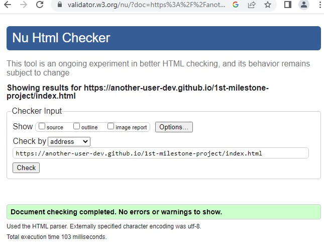

# PROJECT MILESTONE ONE - STYLE CONTROL WEBSITE

## Website:

Live deployed [link](https://another-user-dev.github.io/1st-milestone-project/)

https://another-user-dev.github.io/1st-milestone-project/

This is my first website for the milestone one project. A requirement by Code Institute as part of their learning module and count towards a Level 5 Qualification.

# The main aim of this website
* To allow customers to understand the services and benefits provided by a fictional group of elitist fashion stylists
* Provide an easy pathway for customers looking to up their game in the style stakes
* To give inspiration to customers who are looking to bring out the best version of theirselves

# UX - User Experience 

The project was planned in 5 stages. 

1st stage - Strategy Plane  
2nd stage - Scope Plane  
3rd stage - Structure Plane  
4th stage - Skeleton Plane  
5th stage - Surface Plane   

# The Strategy Plane 

## User Perspective

* Looking to buy services to improve their appearances
* Expedient solution to buying clothes for time poor professionals
* Finding the inspiration to becoming the new version of themseves
* Making efficient use of their wardrobe for maximum gains with minimal outlay

## Business Perspective
* Using the website as a starting point in obtaining customers
* Provide a scalable platform where more services can be offered as the business develops - for example events management
* Promoting their services to time poor professionals 
* Selling services to people who are looking to bring out the best version of themselves
* To provide inspirational ideas to future customers
* To offer value in improving customer lifestyle

# The Scope Plane
To provide a website to bring together customers and stylists. The website consists of three pages. Each page has the following content:

* a stylish home page showcasing their products and sets the narrative on the stylists' background
* a gallery page to provide inspirational ideas to customers 
* a contact page to initiate the come togetherness between customers and stylists

Content must be accessible through a range of technology devices such as mobile phones, tablets, laptops and desktops. Since customers use different devices to access the internet.

The features of the website: 

## The navigation header

The navigation header, as seen as above, appears consistently on the top of the three main content pages. The company's logo is featured on the left hand side of the navigation bar while there are navigation links for other pages on the right hand side. 

This familiar menu bar adds consistency to the design language and helps the user to navigate across the three pages with comfort.

Similarly, the mobile header bar offers the same functionality and purpose as its desktop brethren but in a smaller form factor. The hamburger icon neatly displays and retracts the navigation links.

## Content section

Here we see the content page featuring a hero image  with a carrot on a stick special offer and a call for action button to book a free consultation. 

The mobile content does not feature the hero image but still displays the same carrot on a stick offer with a call for action button to book a free consulation button. 

This allows a mobile device to have a clutter free visual appearance.

## Footer section

The above two images show the footer for the larger screen and mobile phone screen. There is no loss in functionality or feature between the two types of footer. 

## Services

Again, both images display services content in various combinations to take full advantage of screen width at its disposal.

## Gallery Page

The gallery page inspires customers to up their style game and encourage to buy services on offer. Images were sourced from Unsplash.

## Contact Us Page

This simple contact us page provides the customer a facility to contact the stylists. The call for action buttons also links to this page from the hero image text. Thereby the contact us page is a very important structure of the website and starts the journey for customers toward services.

# Structure Plane

The website consists of a home page, gallery page and a contact us page. Each page has a navigation bar in the header, a content section covering the mid part of the page and footer section containing useful information and social media links.

# The Skeleton Plane

My main aim was to produce an effective layout for all device types.

Here are my sketches for the website pages including desktop and mobile devices.

[Wireframe page 1](assets/r-images/readmesketch1.jpg)

[Wireframe page 2](assets/r-images/readmesketch2.jpg)

[Wireframe page 3](assets/r-images/readmesketch3.jpg)

I feel I have mostly achieved in a building a website according to those website.

# Surface Plane

Colours were sourced from Coolers.co and I used Google to find the hex code for blue ink. Usage of colours was sparse and consistent in order to produce an understated corporate style website. Hover pseudo classes were used in conjunction with colour effects on links and buttons. 

Fonts were sourced from Google fonts. Bubble gum Sans provided a nice text for company logo. While Montserrat is a popular font for websites.

Font Awesome provided style fonts such as social media logos as well as visual clues for services within the home content page.

# Technologies utilised

HTML5 for markup  
CSS3 for style  
Google Fonts for fonts  
Github to keep the file  
Gitpod for version control  
Coolers.co to build a colour palette for the site  
Font Awesome for icons  
Unsplash for all the images on the site  
https://www.iloveimg.com/ to compress file size for images  

# Debugging the code for the website

There were a number of issues which slowed the development of the website.

1. Div and section heights had caused formatting issues such as content flowing from one section to another unexpectedly. My mentor had advised on a fix which solved the issue by removing the set height to auto in each section.

2. This Bootstrap code <link rel="stylesheet" href="https://maxcdn.bootstrapcdn.com/bootstrap/4.1.3/css/bootstrap.min.css"> caused the content on the home page to spill out of the content container. Removing this link resulted in the content reverting to its original state.

I originally planned to use Bootstrap for the main navigation and burger menu. I realised Bootstrap was unviable due to the issues as described.

3. A mismatch of section widths caused the content to flow horizontally. This was resolved by ensuring the content widths were harmonised.

4. Implementing the burger menu turned out to be very difficult. This was because the toggle code in the media query required to share the same parent tag in HTML and CSS. This was tested commenting out the code in one section and applying the same code in another.

5. The adblocker in my browser caused the setting up of an image folder to inline in Gitpod. This resulted the folder to have an unexpected file path. The solution was to delete the folder and deactivate the adblocker before setting up a new folder.

6. Github refused to give an active URL for my website after deployment. The issue was resolved after contacting tutor support. The issue resolved itself as soon as I enetered a git push command in Gitpod.

7. The screen reader refused to read out the alt text for the photos in the gallery section. The issue is unresolved but student support indicated that there isn't a penalty for the project as long as the photos have alt text added. The issue did not appear during testing with Firefox browser. 

8. An issue appeared where the footer CSS was corrupted with a cross typo error from git. This caused formatting issues in the footer. Fortunately the problem was identified and corrected.

9. Hamburger icon had an extended background which almost reached the top of the header. Chrome tools was used to investigate the anomaly. Each part of the code in the header was inspected and the styling CSS was displayed under styles. The issue was resolved after deleting the line height and adjusting the margin-top to the CSS code for desktop and mobile. The newly styled Hamburger menu was saved under the commit message "Add styling to Hamburger menu". 

10. Low contrast ratio for white text and cornflower blue background resulted in lowering the Lighthouse accessibility score by 4 to 5% on Lighthouse the gallery and contact page. There was a conflict between design and accessibility. I liked the white text against the blue background which was more consistent with the design of the website. I also wanted the website to have a 100 per cent compliance with accessibility.
 
Further research on accessibility colours led me to this website [UXmovement.com](https://uxmovement.com/buttons/the-myths-of-color-contrast-accessibility/). After reading this article, changing the colours to become more accessibility compliant meant there was no guarantee it would improve accessibility for users. In some cases it may worsen for some. 
 
Upon reflection, I've decided to keep the colours as they are now given the high accessibility Lighthouse scores and the title header not having a significant impact on understanding the content. It is visually obvious the difference between a contact and a gallery page. 

# Manual testing

1. The website was tested on Chrome, Firefox and Brave browsers. No adverse affects were found. I was unable to use Safari as not provided a Windows version for years.

2. The website is easy to navigate and the hamburger menu worked effectively.

3. Responsiveness were tested using all devices and screen widths. No adverse effects were seen for screen widths down to iPhone SE. 

## Home page links

The following Home page was tested for their links:

|                 |                |               |
|-----------------|----------------|---------------|
|          merged row  hhhhhhhhhhhhhhhhhhhhhhhh        |
|-----            |-------         |----           |
| cell            |    Cell        |   Cell        |
|    a            |   b            | c             |

<table class="tg">
<thead>
  <tr>
    <th class="tg-0pky"></th>
    <th class="tg-0pky"></th>
    <th class="tg-0pky"></th>
    <th class="tg-0pky"></th>
    <th class="tg-0pky"></th>
  </tr>
</thead>
<tbody>
  <tr>
    <td class="tg-0pky"></td>
    <td class="tg-0pky"></td>
    <td class="tg-0pky"></td>
    <td class="tg-0pky"></td>
    <td class="tg-0pky"></td>
  </tr>
  <tr>
    <td class="tg-0pky">h</td>
    <td class="tg-c3ow"></td>
    <td class="tg-c3ow"></td>
    <td class="tg-0pky"></td>
    <td class="tg-0pky"></td>
  </tr>
  <tr>
    <td class="tg-0pky"></td>
    <td class="tg-0pky"></td>
    <td class="tg-0pky"></td>
    <td class="tg-0pky"></td>
    <td class="tg-0pky"></td>
  </tr>
</tbody>
</table>

[Logo](https://another-user-dev.github.io/1st-milestone-project/index.html) - links to home page. 
[Home](https://another-user-dev.github.io/1st-milestone-project/index.html) - links to home page. 
[Gallery](https://another-user-dev.github.io/1st-milestone-project/gallery.html) - links to gallery page. 
[Contact](https://another-user-dev.github.io/1st-milestone-project/contact.html) - links to contact page. 
[CTA button](https://another-user-dev.github.io/1st-milestone-project/contact.html) - links to contact page. 
[YouTube](https://www.youtube.com/) - opens another page with YouTube. 
[Facebook](https://www.facebook.com/) - opens another page with Facebook. 
[Reddit](https://www.reddit.com/) - opens another page with Reddit. 
[Twitter](https://www.twitter.com/) - opens another page with Twitter. 

## Gallery page links

The following Gallery page was tested for their links:

[Logo](https://another-user-dev.github.io/1st-milestone-project/index.html) - links to home page. 
[Home](https://another-user-dev.github.io/1st-milestone-project/index.html) - links to home page. 
[Gallery](https://another-user-dev.github.io/1st-milestone-project/gallery.html) - links to gallery page. 
[Contact](https://another-user-dev.github.io/1st-milestone-project/contact.html) - links to contact page. 
[YouTube](https://www.youtube.com/) - opens another page with YouTube. 
[Facebook](https://www.facebook.com/) - opens another page with Facebook. 
[Reddit](https://www.reddit.com/) - opens another page with Reddit. 
[Twitter](https://www.twitter.com/) - opens another page with Twitter. 

## Contact page links

The following Contact page was tested for their links:

[Logo](https://another-user-dev.github.io/1st-milestone-project/index.html) - links to home page. 
[Home](https://another-user-dev.github.io/1st-milestone-project/index.html) - links to home page. 
[Gallery](https://another-user-dev.github.io/1st-milestone-project/gallery.html) - links to gallery page. 
[Contact](https://another-user-dev.github.io/1st-milestone-project/contact.html) - links to contact page. 
[YouTube](https://www.youtube.com/) - opens another page with YouTube 
[Facebook](https://www.facebook.com/) - opens another page with Facebook. 
[Reddit](https://www.reddit.com/) - opens another page with Reddit. 
[Twitter](https://www.twitter.com/) - opens another page with Twitter. 

## Mobile Home page links

The following Home page was tested for their links:

[Logo](https://another-user-dev.github.io/1st-milestone-project/index.html) - links to home page. 
[Home](https://another-user-dev.github.io/1st-milestone-project/index.html) - links to home page. 
[Gallery](https://another-user-dev.github.io/1st-milestone-project/gallery.html) - links to gallery page. 
[Contact](https://another-user-dev.github.io/1st-milestone-project/contact.html) - links to contact page. 
[CTA button](https://another-user-dev.github.io/1st-milestone-project/contact.html) - links to contact page. 
[YouTube](https://www.youtube.com/) - opens another page with YouTube. 
[Facebook](https://www.facebook.com/) - opens another page with Facebook. 
[Reddit](https://www.reddit.com/) - opens another page with Reddit. 
[Twitter](https://www.twitter.com/) - opens another page with Twitter. 

The Hamburger bar worked as expected during the testing of the mobile version of the website. The links above are evidence of a working Hamburger navigation. 

## Mobile Gallery page links

The following Gallery page was tested for their links:

[Logo](https://another-user-dev.github.io/1st-milestone-project/index.html) - links to home page. 
[Home](https://another-user-dev.github.io/1st-milestone-project/index.html) - links to home page. 
[Gallery](https://another-user-dev.github.io/1st-milestone-project/gallery.html) - links to gallery page. 
[Contact](https://another-user-dev.github.io/1st-milestone-project/contact.html) - links to contact page. 
[YouTube](https://www.youtube.com/) - opens another page with YouTube. 
[Facebook](https://www.facebook.com/) - opens another page with Facebook. 
[Reddit](https://www.reddit.com/) - opens another page with Reddit. 
[Twitter](https://www.twitter.com/) - opens another page with Twitter. 

The Hamburger bar worked as expected during the testing of the mobile version of the website. The links above are evidence of a working Hamburger navigation. 

## Mobile Contact page links

The following Gallery page was tested for their links:

[Logo](https://another-user-dev.github.io/1st-milestone-project/index.html) - links to home page. 
[Home](https://another-user-dev.github.io/1st-milestone-project/index.html) - links to home page. 
[Gallery](https://another-user-dev.github.io/1st-milestone-project/gallery.html) - links to gallery page. 
[Contact](https://another-user-dev.github.io/1st-milestone-project/contact.html) - links to contact page. 
[YouTube](https://www.youtube.com/) - opens another page with YouTube. 
[Facebook](https://www.facebook.com/) - opens another page with Facebook. 
[Reddit](https://www.reddit.com/) - opens another page with Reddit. 
[Twitter](https://www.twitter.com/) - opens another page with Twitter. 

The Hamburger bar worked as expected during the testing of the mobile version of the website. The links above are evidence of an Hamburger navigation working as intended. 

## Contact forms

Both large and small screen version of the contact form were tested for their data validation. Data were required for each field.

The submit button functioned as normal.

Limitations of testing: unable to check if data were received by the backend.

# Automated testing

 

# 1. Lighthouse - larger screens
 

## Index page performance
 

 

## Gallery page performance
 

## Contact page performance
 

 

 

# 2. Lighthouse - mobile screens
 

## Index page performance
 

 

## Gallery page performance
 

 

 

## Contact page performance

 

 

# 3. W3c Jigsaw Validator tool
 

## Index page
 

 

## Gallery page
 

 

## Contact page
 

 

#  W3c Jigsaw Validator tool 

## Index page  

   

## Gallery page  

 

## Contact page  

 

# Summary of automated testing 

The automated testing screenshots above shows a clean bill of health in all of their metrics. The Lighthouse's accessibility scores for the gallery and contact pages can be further improved. One way is to use the ink blue colour for the title at the expense of visual design. With more time, one could explore the use of contrasting the light blue through CSS or Photoshop editing.
 

# End User Assessment
 
The website has achieved many of its initial aims:

* almost mimic its original wireframing design
* easy to navigate
* clean design

# Credits

Hannah Morgan: hero image link https://unsplash.com/photos/ycVFts5Ma4s

Olga Zabegina: image https://unsplash.com/photos/A3MleA0jtoE

Laura Chouette: image https://unsplash.com/photos/CjB-8NY5at8

Laura Chouette: image https://unsplash.com/photos/QzekrIW57-4

Jacob Blakenship: image https://unsplash.com/photos/lfJil4DrWRU

Gregory Hayes image: https://unsplash.com/photos/h5cd51KXmRQ

Bejamin Rascoe image: https://unsplash.com/photos/ItqFmSxKnIg

Rafaella Mendes Diniz: image https://unsplash.com/photos/4lFzZTnaIcQ

Ali Morshedlou image: https://unsplash.com/photos/WMD64tMfc4k

Madhi Bafande image: https://unsplash.com/photos/6f5KtX2GGv4
 
Hamburger toggle code from Caler Edwards [YouTube](https://www.youtube.com/watch?v=xMTs8tAapnQ)

Gallery styling and its html structure came from [YouTube](https://www.youtube.com/watch?v=RuJyYiRttpI)

Thanks to:

Spencer Barriball who suggested the use of height: auto to resolve spilling of content into other sections & slight amendments to the contact form.

Chris Quinn, who suggested making slight alterations to contact form, advice on how to resolve the 20 code violations identified from the W3C validation checker.

Oisin from Tutor Support, Code Institute, who helped resolved the live website deployment on Github.

